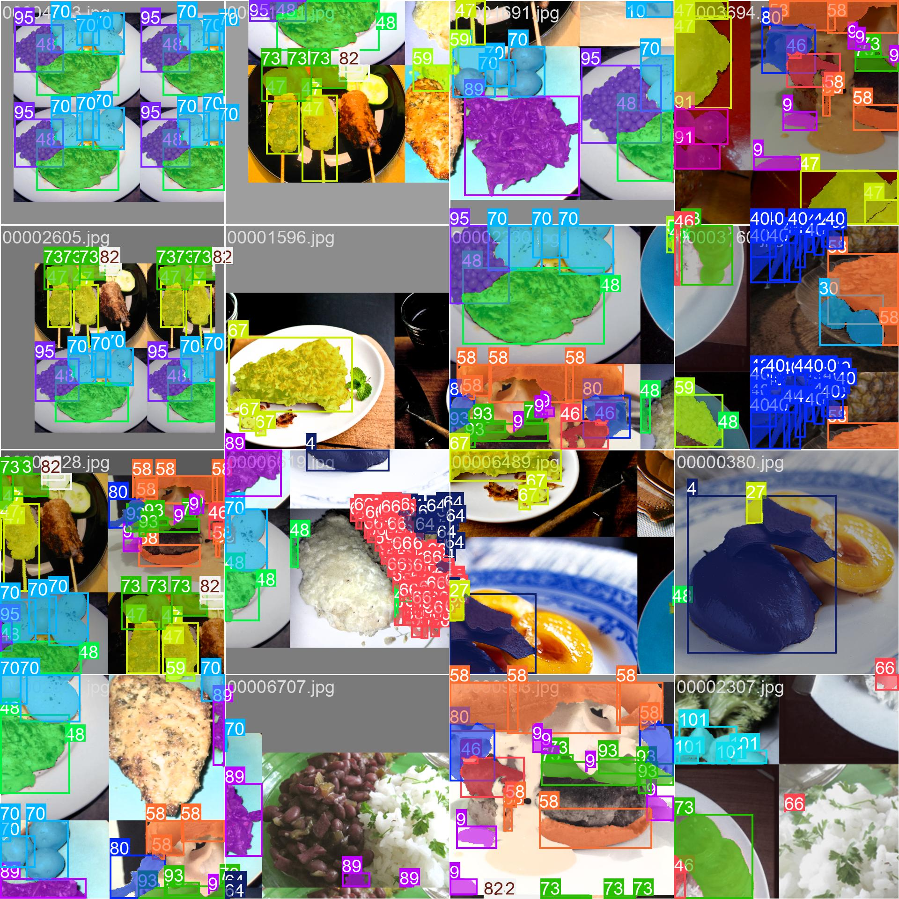

# FoodLens 🍽️

> **Status:** 🚧 Work in Progress - Segmentation Pipeline Complete

An intelligent food analysis application that uses computer vision and deep learning to identify food items and provide detailed nutritional content from photos.

## 📋 Table of Contents

- [Overview](#overview)
- [Features](#features)
- [Architecture](#architecture)
- [Current Challenges](#current-challenges)
- [Technical Decisions](#technical-decisions)
- [Datasets](#datasets)
- [Model Training](#model-training)
- [Development Timeline](#development-timeline)
- [To-Do List](#to-do-list)
- [Future Work](#future-work)
- [Technical Stack](#technical-stack)
- [Monetization](#monetization)
- [References](#references)

## Overview

FoodLens allows users to capture photos of food and receive detailed nutritional analysis. The application leverages advanced segmentation models (YOLOv11-seg) and depth estimation to analyze food composition and provide accurate nutritional information.

The project aims to solve the challenge of accurately identifying multiple food items in a single image, segmenting them, and estimating their volume to calculate nutritional content.

## ✨ Features

- ✅ **Instance segmentation** using YOLOv11-seg trained on FoodSeg103 dataset
- ✅ **Multi-food detection** - identify and segment multiple food items simultaneously
- ✅ **Real-time inference** - ~7.8ms per image on T4 GPU with TensorRT
- ✅ **High accuracy** - trained on high-quality manually labeled dataset with 103 food classes
- 🚧 **Volume estimation** - currently exploring non-AI approaches
- 🚧 **RGBD image processing pipeline** - integration with iPhone depth cameras
- 🚧 **Mobile application UI** - Must be swift to access the hardwares

| yolo11l-seg | yolo11n-seg |
|:---:|:---:|
|  |  |
|  |  |
|  |  |

## 🏗️ Architecture

The application uses a **client-server architecture** for optimal performance:

- **Client (Mobile App)**: 
  - Captures RGBD images using iPhone depth camera capabilities
  - Sends HEIC files with embedded depth data to server
  - Displays nutritional analysis results
  
- **Server (Remote GPU Infrastructure)**:
  - Receives and processes RGBD images
  - Performs instance segmentation using YOLOv11-seg
  - Classifies food items
  - Estimates volume and calculates nutritional content
  - Returns structured JSON response with results

**Why remote processing?** Mobile processors lack sufficient computational power for real-time segmentation, classification, and 3D reconstruction. Server-side processing ensures consistent performance and allows for more complex models.

## 🚧 Current Challenges

### Challenge 1: Volume Estimation [MAJOR]

**Problem:** Need an accurate method for volume estimation that doesn't rely purely on AI/ML approaches.

**Current Status:** Exploring geometric and depth-based estimation methods. Initially experimented with full 3D reconstruction but found it too resource-intensive.

**Attempted Solutions:**
- ❌ **Colmap** - Extremely slow, takes too much GPU time and resources
- ❌ **Open3D** - Similar performance issues
- 🔄 Currently researching depth-based volume estimation using single RGBD images

### Challenge 2: Segmentation Performance [MAJOR - RESOLVED]

**Problem:** Achieving fast, accurate food segmentation for real-time inference.

**Solutions Attempted:**
1. ❌ **Meta's Segment Anything Model (SAM)** 
   - Issue: Inference time way too long for mobile application
   - Not suitable for real-time use case

2. ❌ **FoodSAM** (GitHub: jamesjg/FoodSAM)
   - Issue: Unmaintained repository (last updated 2+ years ago)
   - Could not get it running properly due to environment/dependency issues

3. ❌ **YOLOv11n-seg + FoodInsSeg dataset**
   - Issue: Poor results due to low-quality dataset labels (likely machine-labeled)
   - Many food items not properly segmented

4. ✅ **YOLOv11l-seg + FoodSeg103 dataset** [CURRENT SOLUTION]
   - High-quality manually labeled dataset
   - Excellent segmentation results
   - Acceptable inference time (~7.8ms on T4 with TensorRT)
   - Successfully trained and deployed

### Challenge 3: Cross-Dataset Name Matching [MAJOR]

**Problem:** Nutritional datasets from different sources use inconsistent naming conventions for the same food items.

**Example Issues:**
- Same food may have completely different names across datasets
- Different formatting (e.g., "fried chicken" vs "chicken_fried" vs "FriedChicken")
- Semantic differences not captured by string matching

**Attempted Solutions:**
- ❌ **FuzzyWuzzy library** - Only handles string literal similarities, misses semantic meaning
- 🔄 Exploring NLP-based semantic matching approaches
- 🔄 Considering creation of unified food ontology/mapping table

## 🤔 Technical Decisions

### Why Remote Processing?

**Decision:** Perform all heavy computation on remote GPU servers rather than on-device.

**Reasons:**
- Segmentation models require significant computational resources
- Real-time inference not feasible on mobile CPUs
- Multi-class classification adds computational overhead
- 3D reconstruction (if implemented) extremely resource-intensive
- Apple's ML framework insufficient for these workloads

**Tradeoffs:**
- ✅ Consistent performance across devices
- ✅ Can use larger, more accurate models
- ✅ Easy to update/improve models without app updates
- ❌ Requires internet connection
- ❌ Server costs
- ❌ Potential latency issues

### Where and How to Extract Depth Data?

**Decision:** Extract depth data server-side from HEIC files.

**Reasons:**
- Need color images for classification/segmentation anyway
- HEIC format efficiently stores depth + color data
- Reduces client-side processing complexity
- Server has more resources for depth extraction

**Implementation:** Send HEIC files directly to server. See [Apple's documentation on capturing photos with depth](https://developer.apple.com/documentation/avfoundation/capturing-photos-with-depth) for technical details.

### Development Environment Setup

**Problem:** Initially attempted dual-boot Ubuntu setup, but encountered persistent SSH issues.

**Solution:** 
- Switched to **Windows WSL (Windows Subsystem for Linux)**
- Use **Docker containers** for each developmental stage
- Separate containers for different model experiments
- Git for version control with GitHub integration

**Benefits:**
- Clean isolation between experiments
- Easy reproducibility
- No more dual-boot complications
- Integrated with VS Code for seamless development

### Server Infrastructure

**Initial Consideration:** Self-hosted containerized server on personal PC.

**Actual Solution:** **Railway.app** for deployment

**Why Railway:**
- 30-day free trial for initial development
- Extremely easy deployment - just connect GitHub repo
- Automatic deployment on git push
- Provides public URL for API access
- Auto-rebuilds on repository updates
- No complex server configuration needed

**Note:** The VPS doesn't need powerful specs - it primarily serves as an API endpoint. Actual ML inference happens on rented GPU servers (Vast AI with 3090/3090Ti GPUs).

## 📊 Datasets

### Active Datasets

1. **[Recipe1M+](http://pic2recipe.csail.mit.edu/)**
   - Large-scale recipe and ingredient dataset
   - Used for understanding ingredient relationships
   - Access approved: 04/30/2024

2. **[FoodSeg103](https://github.com/LARC-CMU-SMU/FoodSeg103-Benchmark-v1)** ⭐ [CURRENT]
   - High-quality manual segmentation annotations
   - 103 food categories
   - Excellent label quality
   - Used for YOLOv11l-seg training with great success

3. **[Nutrition5K](https://github.com/google-research-datasets/Nutrition5k)**
   - Direct nutritional value ground truth
   - Enables end-to-end nutritional prediction
   - Removes need for ingredient → nutrition database query step

### Attempted Datasets

4. **~~FoodInsSeg~~** (GitHub: jamesjg/FoodInsSeg)
   - Instance segmentation dataset
   - Initially promising
   - **Issue:** Poor label quality (likely machine-labeled)
   - Resulted in disappointing YOLOv11n-seg performance
   - **Status:** Abandoned in favor of FoodSeg103

## 🎯 Model Training

### Current Production Model

**Model:** YOLOv11l-seg (large variant with segmentation head)

**Training Configuration:**
- **Dataset:** FoodSeg103 (103 classes, manually labeled)
- **Hardware:** 4x NVIDIA 3090Ti GPUs
- **Epochs:** 500 with early stopping enabled
- **Early Stopping Patience:** 100 epochs
- **Training Date:** October 7-8, 2024

**Performance:**
- **Inference Speed:** ~7.8ms per image on NVIDIA T4 with TensorRT optimization
- **Accuracy:** Significantly improved over previous attempts
- **Results:** Production-ready, excellent segmentation quality

### Previous Training Experiments

**Experiment 1: YOLOv11n-seg + FoodInsSeg**
- **Date:** September 23-24, 2024
- **Hardware:** 4x NVIDIA 3090 GPUs
- **Configuration:** 500 epochs, early stopping patience=100
- **Results:** Disappointing - poor coverage, missed many food items
- **Root Cause:** Dataset quality issues (poor labeling)
- **Status:** Discontinued

**Key Learnings:**
- Nano model (11n) vs Large model (11l) performance difference less critical than dataset quality
- Inference time increase from 11n to 11l (1.8ms → 7.8ms) acceptable for quality improvement
- Manual vs machine labeling makes massive difference in final model performance

## 📅 Development Timeline

### Phase 1: Research & Initial Experimentation (April - June 2024)

**April 30, 2024**
- ✅ Gained access to Recipe1M+ dataset
- Begin researching food image datasets and nutritional databases

**May 5, 2024**
- ✅ Built rudimentary testing website
- Supports upload of RGB image + corresponding depth mask
- Basic proof-of-concept for RGBD processing pipeline

**May 18, 2024**
- ❌ Experimented with InverCooking Model from Meta AI
- Results disappointing - likely due to aggressive image resizing (all images to 224x224)
- Decided to train multilabel classification model from scratch

**May 18, 2024 (continued)**
- 🚧 Encountered difficulties downloading datasets
- Plan to rent US-based server for improved download speeds

**June 1, 2024**
- ❌ Tested FoodSAM (uses Facebook's Segment Anything as backbone)
- Cannot execute properly - likely environment misconfiguration or unmaintained repo (last update 2+ years ago)
- 📚 Researched iPhone RGBD image capture and extraction methods
- 🧪 Conducted initial experiments with iPhone 12 + XCode

**June 15, 2024**
- 🎨 Completed early drafts of graphic designs for mobile UI
- 🧪 Started experimenting with Colmap for 3D reconstruction

**June 20, 2024**
- ❌ Concluded Colmap is too inefficient for our use case
- Takes excessive GPU resources and time to output 3D model
- 🔄 Began exploring alternatives: Open3D, Trimesh

### Phase 2: Pivot & Dataset Research (July - August 2024)

**July 1, 2024**
- 🔄 **Major Decision:** Gave up on 3D reconstruction for current version
- Will limit to single-picture inference initially
- Future consideration: Multi-angle videos for 3D reconstruction
- 📚 Began researching segmentation models: SAM (Facebook), YOLO
- 🔍 Searching for food segmentation datasets
- **Challenge:** Food segmentation datasets difficult to find (niche topic)
- **Note:** Recipe1M+ is NOT a segmentation dataset

**September 14, 2024**
- ✅ Built dummy server on Railway for mobile app development
- Server receives requests, returns JSON with nutritional content
- All processing performed server-side
- Enables collaborator (Lucas) to begin app development in parallel

**September 20, 2024**
- 📚 Discovered FoodInsSeg dataset - looks promising
- Instance segmentation dataset with multiple food classes
- 🔄 Began researching YOLO11-seg architecture

**September 21, 2024** (Discussion with collaborator)
- 📝 Architectural decisions:
  - Two-server approach: (1) Application server (frontend/backend), (2) Inference server (ML models)
  - Will explore webhooks for communication between servers
- 💰 Monetization: **NO** (as of right now)
  - Many open-source tools used in development
  - Licenses and acknowledgements still unclear
  - Will not monetize until application fully complete and legal issues resolved
- 🔄 Architecture evolution:
  - Original plan: Extract ingredients → Query nutritional database
  - New plan with Nutrition5K: Direct nutritional prediction (end-to-end)
  - Still leaving room for potential upgrades/alternative approaches

### Phase 3: Training & Iteration (September - October 2024)

**September 23, 2024**
- 🧹 Cleaned and reformatted FoodInsSeg dataset into YOLO format
- 🚀 Uploaded to remote server (4x NVIDIA 3090)
- ▶️ Training started: YOLOv11n-seg, 500 epochs, early stopping patience=100

**September 24, 2024**
- ❌ YOLOv11n-seg results very disappointing
- Many food items not properly covered/detected
- 🔍 Deep dive revealed: Dataset is the problem, not the model
- FoodInsSeg appears to be poorly labeled (likely machine-labeled)
- 🔄 Decision: Find new dataset, upgrade to YOLOv11l-seg
- Inference time increase acceptable (1.8ms → 7.8ms on T4 with TensorRT)

**October 7, 2024**
- 📚 Discovered FoodSeg103 dataset
- High-quality manual labeling
- 103 food categories with excellent annotation quality
- 🔄 Switched to YOLOv11l-seg (large model)
- 🚀 Training started: 500 epochs, early stopping patience=100, 4x 3090Ti

**October 8, 2024** ⭐
- ✅ **SUCCESS!** Training results exceed expectations
- Excellent segmentation performance
- Combination of larger model + significantly better dataset quality
- **Status:** Production-ready model achieved

## ✅ To-Do List

### High Priority

- [ ] **Volume Estimation Implementation**
  - Research non-AI geometric approaches
  - Leverage depth data from RGBD images
  - Validate against known volumes

- [ ] **Comprehensive RGBD Pipeline**
  - Build robust image capture flow in mobile app
  - Implement RGBD data extraction and upload
  - Handle camera intrinsics properly
  - Error handling for depth capture failures

- [ ] **Production Mobile Application**
  - Complete UI/UX implementation
  - Integrate with inference server API
  - Handle network errors gracefully
  - Implement caching for offline viewing of past results

### Medium Priority

- [ ] **Ingredient Proportion Estimation**
  - Determine how to estimate ingredient ratios in mixed dishes
  - Research existing approaches (if any)
  - May require additional training data

- [ ] **Cross-Dataset Name Matching Solution**
  - Explore NLP/semantic similarity approaches
  - Consider building unified food ontology
  - Create mapping tables between major nutritional databases

- [ ] **API Documentation**
  - Document all server endpoints
  - Provide example requests/responses
  - Create integration guide for frontend

### Low Priority / Future Enhancements

- [ ] **Multi-Angle Video Support**
  - Allow users to capture multiple angles
  - Implement 3D reconstruction (if performance improves)
  - More accurate volume estimation

- [ ] **User Account System**
  - Save user history
  - Track nutritional intake over time
  - Personalized recommendations

- [ ] **Expanded Dataset**
  - Fine-tune on regional/cultural foods
  - Improve coverage of uncommon food items

## 🚀 Future Work

- **Multi-Angle Video Support:** Allow users to capture food from multiple angles for improved 3D reconstruction and more accurate volume estimation
- **Ingredient Proportion Estimation:** Develop methods to estimate ratios of different ingredients in mixed dishes (e.g., percentage of rice vs vegetables in a bowl)
- **Enhanced RGBD Pipeline:** Build comprehensive concurrent system for extraction, upload, and bidirectional communication
- **Production Mobile App:** Complete React Native application with polished UI/UX
- **Database Integration:** Full integration with nutritional databases for ingredient-based queries
- **Portion Size Recommendations:** Provide suggestions based on dietary goals
- **Multi-Language Support:** Expand to support food names in different languages
- **Allergen Detection:** Warn users of potential allergens based on identified foods

## 📚 References

### Research Papers & Models

- [FoodSAM Paper](https://arxiv.org/abs/2308.05938)
- [FoodSAM Repository](https://github.com/jamesjg/FoodSAM)
- [Ultralytics YOLOv11](https://docs.ultralytics.com/)
- **Inverse Cooking (Meta)**
  - [Blog](https://ai.meta.com/blog/inverse-cooking/)
  - [Paper](https://github.com/facebookresearch/inversecooking)
  - [Source Code](https://github.com/facebookresearch/inversecooking/tree/master)
- [KitchenScale: Ingredient quantity estimation](https://github.com/dmis-lab/KitchenScale)
  - [Associated paper](https://www.sciencedirect.com/science/article/abs/pii/S0957417423005432?via%3Dihub)
- [Ingredient Weight Estimation Model (GitHub)](https://github.com/Annkkitaaa/Ingredient-Weight-Estimation-Model)
- [Food Ingredients Recognition through Multi-label Classification (PapersWithCode)](https://paperswithcode.com/paper/food-ingredients-recognition-through-multi-1)
- [Nature, Volumetric Food Recognition Paper](https://www.nature.com/articles/s41598-023-47885-0)

### Example Apps & Use Cases

- [Ultralytics Blog: AI in Nutrition](https://www.ultralytics.com/blog/ai-in-nutrition-streamlining-healthy-eating-with-computer-vision)
- [Ultralytics open source code](https://github.com/ultralytics)
- [Best Nutrition and Diet Tracking Apps (2025 list)](https://softwarehouse.au/blog/best-nutrition-and-diet-tracking-apps-to-optimise-health-in-2025/)

### Documentation

- [Apple Depth Capture Guide](https://developer.apple.com/documentation/avfoundation/capturing-photos-with-depth)
- [PyTorch Documentation](https://pytorch.org/docs/)
- [Docker Documentation](https://docs.docker.com/)

### Datasets

- [FoodSeg103 Benchmark](https://github.com/LARC-CMU-SMU/FoodSeg103-Benchmark-v1)
- [Nutrition5K Dataset](https://github.com/google-research-datasets/Nutrition5k)
- [Recipe1M+ Dataset](http://pic2recipe.csail.mit.edu/)
- [FoodInsSeg](https://github.com/jamesjg/FoodInsSeg)

### Tools & Services

- [Railway.app](https://railway.app/) - Deployment platform
- [Vast AI](https://vast.ai/) - GPU rental service

---

**Project Started:** April 2024  
**Last Updated:** October 2024  
**Status:** Active Development - Segmentation Complete, Volume Estimation & App Development In Progress

---

## 📝 Notes

This project represents an ongoing exploration of computer vision applied to nutritional analysis. While significant progress has been made in segmentation, several challenges remain, particularly around volume estimation and cross-dataset integration. The project prioritizes accuracy and user experience over rapid deployment.

If you have suggestions, find bugs, or want to contribute, feel free to open an issue or submit a pull request!
